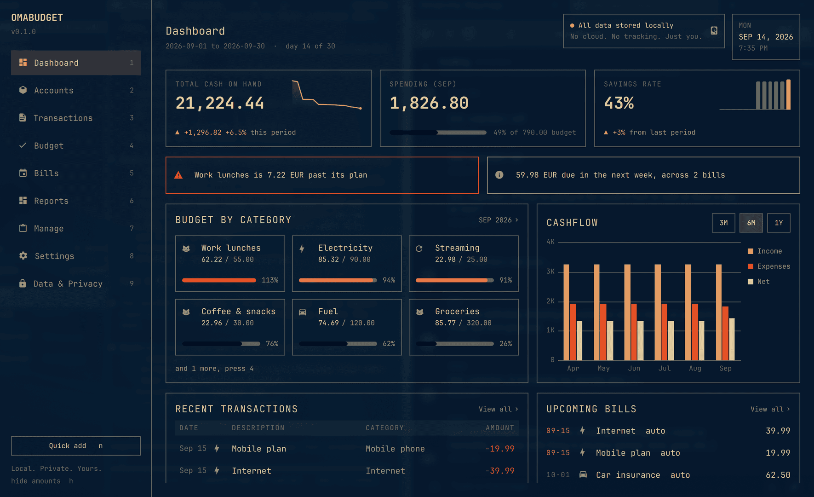

# OMABUDGET

Local-first personal finance for Omarchy: accounts, a ledger, budgets and
bills. All data is stored on this machine, in one SQLite file, and nowhere
else. No cloud, no tracking, no bank connection.

A bar widget shows spending this period at a glance; clicking it opens the app
as its own window.

## What it does

- **Accounts**: checking, savings, cash, credit cards, loans, investments and
  the rest, each in its own currency, with a low-balance line if you want one.
- **Ledger**: expenses, income and transfers, split across categories, with
  a payee, tags and notes. Quick-add from any screen or from the bar in a few
  keystrokes: Tab from the amount opens the category picker and typing filters
  it, and the account is chosen from a list rather than typed. Edit, search,
  filter, delete with undo and a thirty-day recycle bin. The search box takes
  `tag:weekly`, `payee:market`, `>50` and `<200` alongside the words. Mark a
  handful with Space to move them to a category, tag them or delete them in
  one go. The amount is labelled with the chosen account's currency and, when
  that is not the one rates are quoted against, says what it will land as:
  `= 11.75 EUR at 0.235`.
  A transfer between two currencies records what landed on both sides.
- **Categories**: the spec's taxonomy is seeded on first run, from housing and
  food to transport, health and the pets, and is yours after that. Add a group
  or a child, rename one without moving a single transaction, give it a glyph,
  keep it out of the statistics, archive it out of the pickers, or remove one
  nothing points at.
- **Reconciliation**: hold a bank statement against the ledger. Put in what it
  closed at, tick the lines it shows, leave the rest pending, and settle it
  when the difference is nothing; settled lines close for good. A transfer is
  one line with one status, so settling it on one account settles it on both.
- **Payees**: made by naming one on a transaction, the way a tag is. Rename
  one, say what it is usually booked to, give it another name it goes by, or
  fold two into one, which moves every transaction and keeps the old spelling
  as an alias so the next import lands on the right payee.
- **Exchange rates**: a rate per currency per day, every one quoted against
  a reference currency the ledger fixes when it is first opened. Balances,
  net worth, the cash line and every headline figure convert at the rate on
  file instead of leaving a foreign account out, and say so when no rate
  covers one. Correcting a rate re-derives every transaction that follows the
  table; one entered with its own rate keeps it. The currency figures are
  shown in is a setting, `omabudget settings base-currency`, converted from
  the reference at today's rate, so it can change at any time and nothing
  stored moves. A first run starts from a dated set for euro, dollar and
  zloty, whichever of them is not the reference, so a foreign account counts
  from the beginning. Nothing is ever fetched, so those three are a starting
  point carrying the date they were taken; correct them with `omabudget rate
  set`, and once the table has anything in it the starting set never returns.
- **Budget**: a planned amount per category, or envelopes where money is
  assigned to pots first and rolls over by each category's behaviour, with
  goals that save toward a target by a month. Helpers copy the previous
  period, plan from the average or the median of past periods, or scale every
  line. Periods begin on the day you choose, payday included.
- **Bills**: recurring rules from daily to annual, anchored to a day of the
  month or its last day, posted automatically or confirmed on the day they
  were paid, for the amount paid.
- **Insights**: two or three lines at the top of the dashboard saying what the
  figures do not say on their own: whether spending is ahead of the plan, what
  has gone past it, what is about to be taken against what is on hand, and
  which way the savings rate moved. The command line prints the same lines.
- **Reports**: spending by category against the period before, income against
  expense over twelve periods, average per day, projected period end, runway
  and the share of spending posted by rules.
- **Alerts**: watches on budget lines at warn or over, bills due or overdue,
  large postings and low accounts, delivered to the desktop. Arm one yourself
  on any figure or list the daemon keeps, for a span you choose, once or every
  time.
- **Agents**: an MCP endpoint, off by default, through which an agent you
  already use reads the same figures and records a transaction.

Every amount can be hidden with one key, for screen sharing. Money is kept as
integer minor units in the reference currency and shown in the one you
choose, and nothing is ever stored as a float.

## The app

The window has nine views on a rail, reached with the digits 1 to 9.
**Manage**, on 7, is where the ledger's own furniture lives: categories,
payees, exchange rates and armed watches, one pane each, `Tab` between them.
The keys are the same in every view where they make sense:

| key | does |
|---|---|
| `n` | quick-add from anywhere |
| `h` | hide every amount, and the token |
| `j` `k` | move the cursor |
| `Enter` | open, edit, post or plan the current row |
| `a` | add: a transaction, an account, a bill, a category |
| `d` `u` | delete a transaction, undo |
| `/` `b` | search the ledger, show the recycle bin |
| `Space` | mark a row; `d` then acts on every marked row |
| `[` `]` | previous and next period, in Budget and Reports |
| `c` `v` `m` `+` `-` | budget helpers: copy last, average, median, scale |
| `r` `g` | roll the envelopes over in Budget, set a goal |
| `s` `p` `x` | skip a bill, post it, remove a rule or archive a category |
| `r` | in Accounts, hold a statement against the account |
| `Tab` | next pane, in Manage |
| `t` | jump from a report line to its transactions |
| `Esc` | close a form, clear a filter, close the window |

## The command line

Everything the app does, the daemon does for `omabudget` too, which lives in
the plugin's `bin/` folder:

    omabudget add 4.50 coffee
    omabudget add 23.50+18 groceries -desc "Weekly shop" -tag weekly
    omabudget add 48.30 -split "Groceries=30.00" -split "Fuel=18.30:on the way"
    omabudget add 3250 "Primary salary" -income
    omabudget add 500 -transfer-to Savings
    omabudget transactions -q coffee -kind expense -from 2026-09-01
    omabudget transactions -tag weekly -payee "Whole Foods" -min 50
    omabudget edit <id> -amount 12.80 -category "Work lunches"
    omabudget edit <id> <id> <id> -category Groceries -add-tag audit
    omabudget category add "Side projects" -kind income
    omabudget category add "Plugin sales" -parent "Side projects"
    omabudget category edit Groceries -name "Food shopping" -icon 󰄛
    omabudget category archive "Coffee & snacks"
    omabudget payee rename "AMZN MKTP" Amazon
    omabudget payee alias Amazon "AMAZON EU SARL"
    omabudget payee merge "Whole Foods Market" "Whole Foods"
    omabudget reconcile Checking 1842.19 -through 2026-08-31
    omabudget reconcile Checking 1842.19 -through 2026-08-31 -finish
    omabudget budget set Groceries 350
    omabudget budget average 3
    omabudget bill add Rent 1200 Rent -every monthly -start 2026-10-03 -auto
    omabudget bills
    omabudget report spending
    omabudget rate set USD 0.92
    omabudget arm accounts.low appears -reason "top it up before the rent"
    omabudget arm period.spent crosses -above 150000 -expires-in 720h
    omabudget export -o ~/Documents/ledger.journal
    omabudget backup -o ~/Documents/ledger.db

`omabudget help` lists every verb; `-json` on any of them prints what the
daemon answered, verbatim.

## Install

    omarchy plugin add https://github.com/karamble/omarchy-omabudget
    omarchy plugin enable karamble.omabudget right
    omarchy-restart-shell

Only source is shipped, so the helpers are compiled once on your machine. The
app offers a **Build now** button, or from the plugin directory:

    cd ~/.config/omarchy/plugins/karamble.omabudget
    make

Requires the Go toolchain, 1.25 or newer. The first build fetches the SQLite
driver, about 40 MB of Go source, so it takes a minute; later builds are cached.

### What the build guarantees

`make` runs in your shell, with your PATH, because that is what building from
source means. Within that, the build is pinned rather than open-ended:

- `GOTOOLCHAIN=local` means the go command uses the toolchain you installed. It
  will not silently fetch a different one over the network.
- `CGO_ENABLED=0` means no C compiler is involved and the binary does not vary
  with whether one is present. The SQLite driver is pure Go.
- `-mod=readonly` refuses to edit `go.mod` or `go.sum` mid-build, and
  `make verify` runs `go mod verify` before anything compiles.
- `-trimpath -buildvcs=false` keep local paths and the git revision out, so two
  builds of the same commit are byte-identical.

## The window

The app is a normal window, so Hyprland tiles it like any other. It is laid
out for 1180 by 720 and reads best floating. Add this to `~/.config/hypr/bindings.lua`
to float it centred at that size, and to open it from a key:

    o.window({ class = "^org.quickshell$", title = "^OMABUDGET$" }, { float = true, center = true, size = { 1180, 720 } })
    o.bind("SUPER + ALT + B", "OMABUDGET", "omarchy-shell shell toggle karamble.omabudget '{}'")

The plugin does not touch your Hyprland configuration itself.

## Where it writes

- `~/.config/omarchy/plugins/karamble.omabudget/`: the plugin itself
- `~/.config/omabudget/`: `config.json`, `ledger.db` and `triggers.json`, all
  mode 0600, written through a descriptor held on that directory

Exports and backups go where you say, inside your home directory, and the
daemon refuses any other path. The ledger is deliberately not placed in a
synced folder: a database synced while open corrupts. To keep a copy elsewhere
use `omabudget export`, which writes a balanced plain-text journal (or CSV
with `-format csv`), or `omabudget backup`, which writes a consistent copy of
the database.

There is no systemd unit. The daemon is a child of the shell through the
plugin's service entry point, so disabling or removing the plugin stops it.

## Agents over MCP

OMABUDGET can serve MCP on loopback behind a bearer token, so an agent you
already use can read what it holds. **The endpoint is off until you switch it
on**, in Settings or with `omabudget mcp-endpoint on`.

`omabudget mcp` prints the entry to paste into an agent's config, and
`omabudget recycle` mints a new token and shows the updated entry once, locking
out everything holding the old one.

The tools: `omabudget_dashboard`, `omabudget_transactions`,
`omabudget_add_transaction`, `omabudget_budget`, `omabudget_bills`,
`omabudget_spending`, and for the watches `omabudget_catalogue`,
`omabudget_alerts`, `omabudget_arm`, `omabudget_edit`, `omabudget_disarm` and
`omabudget_health`. They read through the same builders the app reads, so an
agent and the window never see different figures.

OMABUDGET installs nothing into any agent's configuration and ships no
instructions for one. The tool schemas describe what each tool does; that is
the whole of it.

## Removal

Purge first, then remove, because the binary that purges lives in the folder
removal deletes:

    ~/.config/omarchy/plugins/karamble.omabudget/bin/omabudget purge
    omarchy plugin remove karamble.omabudget

`purge` deletes `~/.config/omabudget/` and everything in it, your ledger
included. Skipping it leaves your data behind, which is deliberate: removing a
plugin should not silently destroy a financial record.

## Licence

ISC. See LICENSE.
